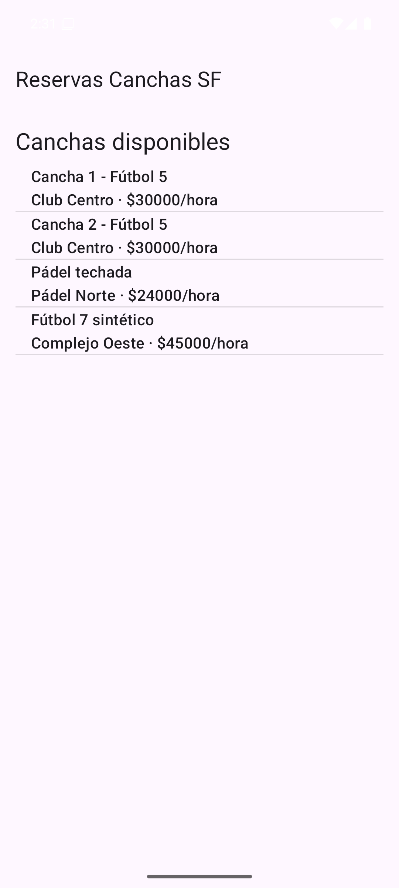
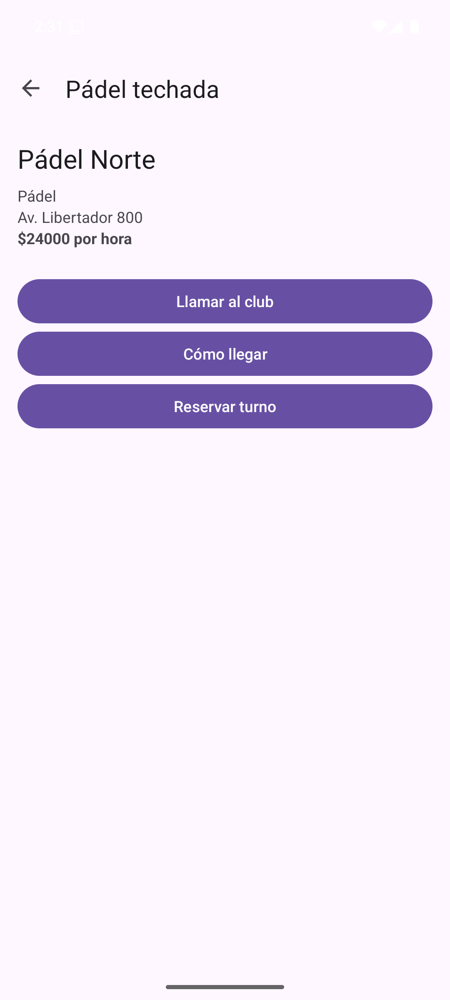
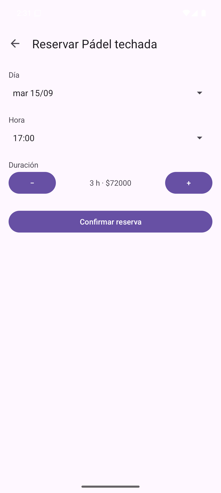
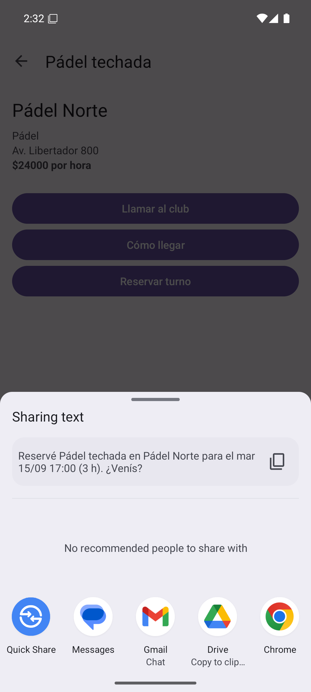
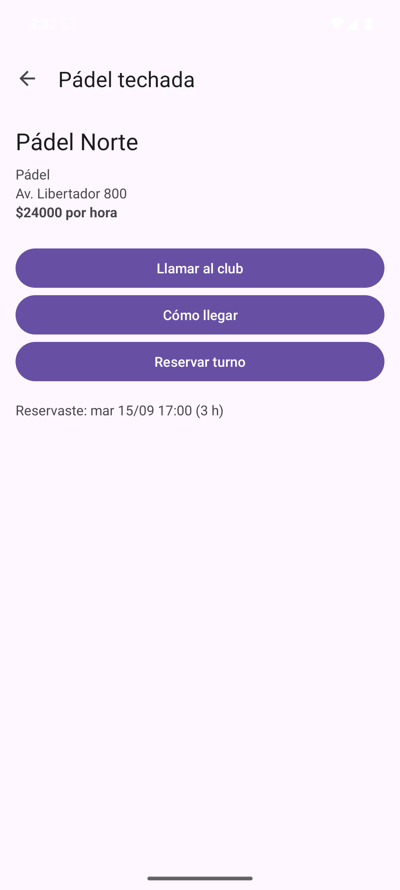
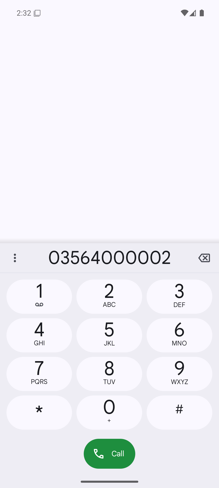
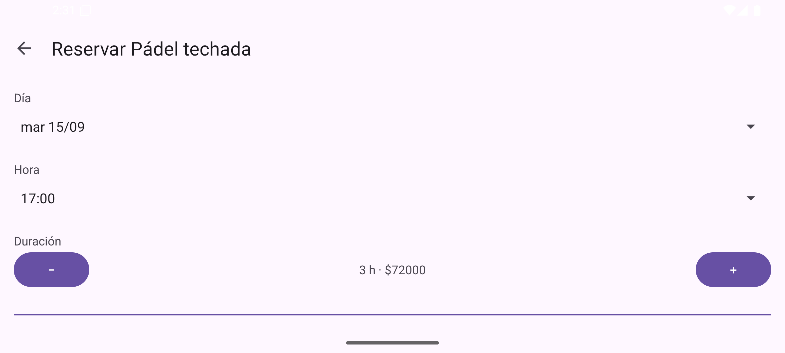

# Trabajo Práctico 1 — Desarrollo de Aplicaciones Móviles

**Cátedra:** Arquitecturas Móviles · Ing. Juan Pablo Bono
**Carrera:** Ingeniería en Sistemas de Información — UTN FR San Francisco
**Alumno:** Fernando Mare
**Fecha:** 14/09/2026
**Repositorio:** https://github.com/mareFernando03/reservas-canchas-sf

---

## 1. Objetivo

Según la guía del TP1: entender los requerimientos, alcances y limitaciones en el desarrollo de
aplicaciones móviles. Para eso se configuró el entorno con Android Studio y se desarrolló una
aplicación básica con Android Manifest, Activities e Intents, con pequeñas funcionalidades que
permiten observar el ciclo de vida de una aplicación Android.

## 2. La aplicación: Reservas Canchas SF

En San Francisco los turnos de fútbol 5, fútbol 7 y pádel se reservan por teléfono o WhatsApp,
club por club. La app propone centralizarlo: ver qué canchas hay, cuánto cuestan, cómo llegar y
reservar un turno desde el celular.

Es la aplicación sobre la que se van a construir los trabajos siguientes (MVP con Firebase en el
TP2, escalabilidad, monetización y retención en los posteriores). En este TP1 no hay backend: los
datos de las canchas son de ejemplo y viven en memoria.

## 3. Requerimientos funcionales

| ID | Requerimiento | Estado en el TP1 |
|---|---|---|
| RF01 | Listar las canchas disponibles con club, deporte y precio por hora. | Implementado (datos de ejemplo) |
| RF02 | Ver el detalle de una cancha: club, deporte, dirección y precio. | Implementado |
| RF03 | Llamar al club desde la app. | Implementado |
| RF04 | Ver la ubicación de la cancha en un mapa. | Implementado |
| RF05 | Elegir día, hora y duración del turno y ver el total a pagar. | Implementado |
| RF06 | Confirmar la reserva y compartirla con otras personas. | Implementado (sin guardar la reserva) |
| RF07 | Registrarse e iniciar sesión. | Pendiente — TP2 (Firebase Authentication) |
| RF08 | Guardar las reservas y mostrar la disponibilidad real de cada horario. | Pendiente — requiere backend |
| RF09 | Pagar o señar el turno en línea. | Pendiente — TP4 (monetización) |
| RF10 | Recibir un recordatorio antes del turno. | Pendiente — TP6 (notificaciones push) |
| RF11 | Que cada club cargue sus canchas, horarios y precios. | Pendiente |

## 4. Requerimientos no funcionales

| ID | Requerimiento | Estado en el TP1 |
|---|---|---|
| RNF01 | Funcionar en Android 8.0 o superior (`minSdk` 26), apuntando a Android 16 (`targetSdk` 36). | Cumplido |
| RNF02 | No perder lo que el usuario cargó al rotar la pantalla o cuando el sistema recrea la Activity. | Cumplido (ver sección 7) |
| RNF03 | Respetar el modo *edge-to-edge* obligatorio desde Android 15: el contenido no queda tapado por las barras del sistema. | Cumplido |
| RNF04 | No depender de apps concretas: llamar, abrir el mapa y compartir usan Intents implícitos, y si no hay una app que los atienda se avisa sin cerrar la aplicación. | Cumplido |
| RNF05 | Interfaz en español y textos centralizados en `strings.xml`. | Cumplido |
| RNF06 | Proteger los datos personales y de pago de los usuarios. | Pendiente — en el TP1 no se piden datos personales |

## 5. Entorno de desarrollo

| Componente | Versión |
|---|---|
| IDE | Android Studio Quail 4 (2026.1.4) |
| Lenguaje | Kotlin (integrado en Android Gradle Plugin 9) |
| Android Gradle Plugin / Gradle | 9.4.0 / 9.7.1 |
| JDK | JetBrains Runtime 25, incluido en Android Studio |
| Android SDK | Platform 36, Build-Tools 36.1.0 |
| Emulador | Pixel 6, Android 16 (API 36) x86_64, aceleración WHPX |
| Librerías | AndroidX Core 1.17, AppCompat 1.7.1, Material Components 1.13 |

## 6. Estructura de la aplicación

### 6.1. AndroidManifest

- Declara las tres Activities. Sólo `MainActivity` tiene el `intent-filter` `MAIN` / `LAUNCHER`,
  así que es la única que se abre desde el ícono; las otras dos son `exported="false"`.
- `parentActivityName` define la navegación hacia arriba: Reserva → Detalle → Lista.
- El bloque `<queries>` declara los Intents implícitos que usa la app (`DIAL`, `VIEW` con `geo:` y
  `SEND`). Desde Android 11 es necesario para que la app pueda ver qué otras apps los atienden.

### 6.2. Activities

| Activity | Responsabilidad |
|---|---|
| `CicloDeVidaActivity` | Clase base. Registra en Logcat cada callback del ciclo de vida y configura la barra superior. |
| `MainActivity` | Muestra la lista de canchas. |
| `DetalleCanchaActivity` | Muestra una cancha y ofrece llamar, ver el mapa y reservar. |
| `ReservaActivity` | Permite elegir día, hora y duración, y confirmar la reserva. |

### 6.3. Intents

| Desde → hacia | Tipo | Para qué |
|---|---|---|
| Lista → Detalle | Explícito, con *extra* | Abre el detalle pasando el id de la cancha elegida. |
| Detalle → Reserva | Explícito, con resultado | `registerForActivityResult` abre la reserva; al confirmar, la reserva devuelve el turno con `setResult` y el detalle lo muestra. |
| Detalle → marcador | Implícito `ACTION_DIAL` | Abre el marcador con el teléfono del club, sin llamar. |
| Detalle → mapas | Implícito `ACTION_VIEW` + `geo:` | Abre la app de mapas en la dirección de la cancha. |
| Reserva → otras apps | Implícito `ACTION_SEND` con *chooser* | Comparte el texto de la reserva por la app que elija el usuario. |

## 7. Ciclo de vida

Todas las pantallas heredan de `CicloDeVidaActivity`, que escribe en Logcat (etiqueta
`CicloDeVida`) cada llamada a `onCreate`, `onStart`, `onResume`, `onPause`, `onStop`,
`onRestart`, `onDestroy` y `onSaveInstanceState`. Extracto del recorrido de las capturas:

```
MainActivity.onPause
DetalleCanchaActivity.onCreate (nueva)
DetalleCanchaActivity.onStart
DetalleCanchaActivity.onResume
MainActivity.onStop
MainActivity.onSaveInstanceState
...
ReservaActivity.onPause                          <- se rota la pantalla
ReservaActivity.onStop
ReservaActivity.onSaveInstanceState
ReservaActivity.onDestroy
ReservaActivity.onCreate (recreada, con estado guardado)
ReservaActivity.onStart
ReservaActivity.onResume
...
ReservaActivity.onPause                          <- se confirma la reserva
DetalleCanchaActivity.onRestart
DetalleCanchaActivity.onStart
ReservaActivity.onStop
ReservaActivity.onDestroy
DetalleCanchaActivity.onResume
```

Lo que muestra el registro:

- **Al abrir otra pantalla**, la anterior pasa por `onPause` antes de que la nueva se cree, y
  recién hace `onStop` cuando la nueva ya está visible.
- **Al rotar**, Android destruye la Activity y la vuelve a crear. Los *spinners* conservan su
  selección solos, pero la duración del turno es una variable de la Activity: se perdería si no se
  guardara. Por eso `ReservaActivity` la guarda en `onSaveInstanceState` y la recupera en
  `onCreate`. Las capturas 3 y 4 muestran que después de rotar sigue en 3 h · $72000.
- **Al volver**, la pantalla anterior no se crea de nuevo: pasa por `onRestart`, `onStart` y
  `onResume`, mientras la que se cierra termina en `onDestroy`.

El registro completo está en `docs/ciclo-de-vida.log` del repositorio.

## 8. Capturas

<div class="capturas">
<figure><figcaption>1. Lista de canchas</figcaption></figure>
<figure><figcaption>2. Detalle</figcaption></figure>
<figure><figcaption>3. Reserva, 3 horas</figcaption></figure>
<figure><figcaption>5. Compartir la reserva</figcaption></figure>
<figure><figcaption>6. Turno devuelto al detalle</figcaption></figure>
<figure><figcaption>7. Marcador con el teléfono del club</figcaption></figure>
</div>

<figure class="ancha"><figcaption>4. La misma reserva después de rotar: la duración se conserva</figcaption></figure>

## 9. Repositorio

Código fuente, capturas y registro del ciclo de vida:
**https://github.com/mareFernando03/reservas-canchas-sf**
