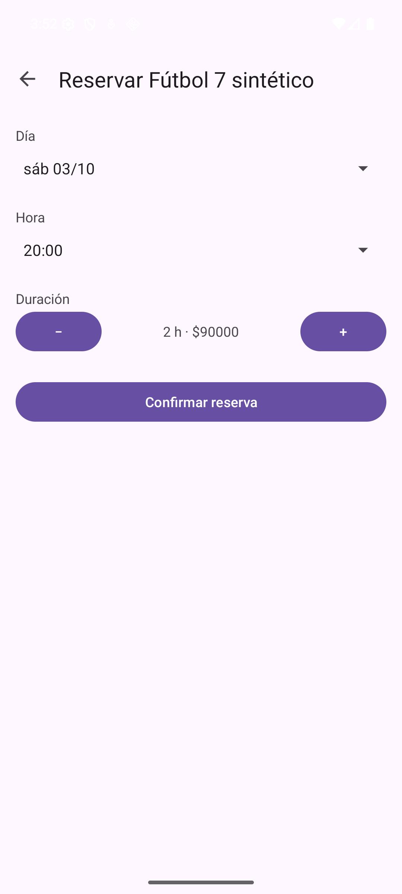
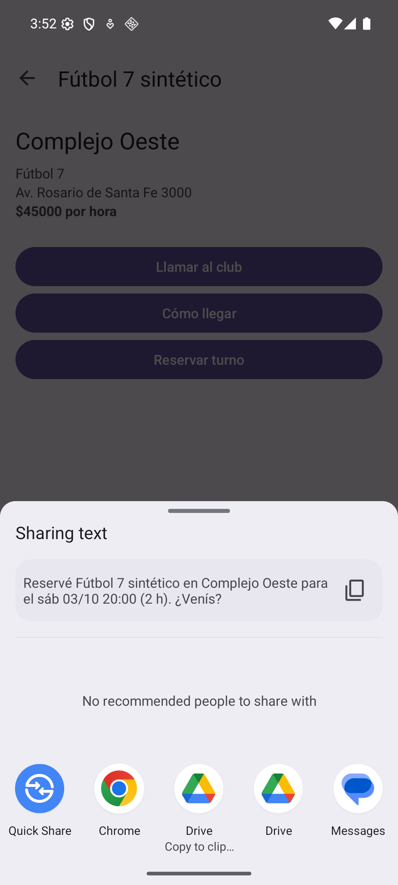

# Trabajo Práctico 2 — Aplicación del Ciclo de Build-Measure-Learn

**Cátedra:** Arquitecturas Móviles · Ing. Juan Pablo Bono  
**Carrera:** Ingeniería en Sistemas de Información — UTN FR San Francisco  
**Alumno:** Fernando Mare  
**Fecha:** 01/10/2026  
**Repositorio:** https://github.com/mareFernando03/reservas-canchas-sf

---

## 1. Objetivo

Según la guía del TP2: aplicar el ciclo Build-Measure-Learn en el desarrollo de una aplicación
móvil. Se parte de la app del TP1 (Reservas Canchas SF), se define su Producto Mínimo Viable,
se construye con Firebase Authentication, se evalúa y con lo aprendido se actualiza el diagrama
de arquitectura.

## 2. Definición del MVP

El capítulo 6 de *Lean Mobile App Development* ("MVP is Always More Minimal Than You Think")
toma la definición de Eric Ries: el MVP es la versión de un producto nuevo que permite obtener
la mayor cantidad de aprendizaje validado sobre los clientes con el menor esfuerzo. El libro
propone definirlo juntando sólo los componentes que, combinados, hacen al producto viable (el
ejemplo de la patineta: tabla, ruedas y ejes) y no cubrir todos los casos de uso desde el
principio.

**Problema.** En San Francisco los turnos de fútbol 5, fútbol 7 y pádel se reservan por teléfono o
WhatsApp, club por club. Para saber qué hay libre y cuánto cuesta hay que preguntar en cada uno.

**Hipótesis a validar.** Un jugador prefiere ver las canchas de la ciudad en un solo lugar y armar
la reserva desde el celular antes que llamar club por club.

**Qué entra en el MVP.** Siguiendo la idea de la patineta, los componentes que juntos permiten
recorrer el camino completo de una reserva. Ninguno sirve solo: una lista sin reserva no resuelve
nada, y una reserva sin cuenta no queda a nombre de nadie.

| Funcionalidad | Por qué entra |
|---|---|
| Registro e inicio de sesión (RF07) | Una reserva tiene que quedar a nombre de alguien. |
| Lista de canchas con club, deporte y precio (RF01) | Es la propuesta de valor: todo en un solo lugar. |
| Detalle, llamar al club y cómo llegar (RF02–RF04) | Resuelve las dudas antes de reservar. |
| Elegir día, hora y duración y ver el total (RF05) | Es la acción que se quiere medir. |
| Confirmar y compartir con el grupo (RF06) | Un partido se arma entre varios. |

**Qué queda afuera.** Pago en línea (TP4), recordatorios push (TP6), que cada club cargue sus
canchas y la disponibilidad real de horarios (RF08). No hacen falta para saber si la hipótesis se
sostiene.

**Qué se mide.** El libro plantea la fase *Learn* con dos preguntas: si el MVP resuelve un
problema de sus usuarios y si es viable, es decir, si ofrece algo por lo que estarían dispuestos a
pagar. Para responderlas se mide si los usuarios completan una reserva sin ayuda, dónde se traban,
si la usarían en lugar de llamar y si pagarían la seña desde la app (ver sección 4).

## 3. Construcción del MVP

### 3.1. Cambios respecto del TP1

| Componente | Cambio |
|---|---|
| `LoginActivity` | Nueva. Pantalla de inicio con registro e ingreso por email y contraseña. Si ya hay una sesión abierta pasa directo a la lista. |
| `MainActivity` | Muestra el email del usuario en la barra y agrega "Cerrar sesión" en el menú. Deja de ser la pantalla del launcher. |
| `Medicion` | Nueva. Envía a Firebase Analytics los eventos de uso de la sección 4. |
| `DetalleCanchaActivity`, `ReservaActivity` | Registran los eventos de uso. |
| `AndroidManifest.xml` | `LoginActivity` pasa a ser la Activity `LAUNCHER`; se declara el permiso `INTERNET`. |
| Gradle | Plugin `com.google.gms.google-services` 4.5.0 y Firebase BoM 34.19.0 con `firebase-auth` y `firebase-analytics`. |

### 3.2. Configuración de Firebase

1. Se creó el proyecto en la consola de Firebase y se registró la app Android con el paquete
   `ar.edu.utn.frsf.canchas`.
2. Se descargó `google-services.json` en `app/`. El plugin de Google Services lo lee al compilar.
3. En Authentication se habilitó el proveedor **Correo electrónico/contraseña**.

### 3.3. Autenticación

`LoginActivity` usa `FirebaseAuth`: `createUserWithEmailAndPassword` para crear la cuenta y
`signInWithEmailAndPassword` para ingresar. Las dos llamadas son asíncronas y responden en un
*listener*. Mientras esperan, los botones quedan deshabilitados para no mandar dos pedidos. Los
errores de Firebase se traducen a mensajes en español: contraseña de menos de 6 caracteres, email
ya registrado, credenciales incorrectas y falta de conexión.

Firebase conserva la sesión entre aperturas de la app, así que el login se ve una sola vez. Las
contraseñas no pasan por la app ni se guardan en el teléfono: las administra Firebase (RNF06).

### 3.4. Cómo se probó

El login se probó contra el **emulador local de Firebase Authentication** (Firebase Local
Emulator Suite), para no dejar cuentas de prueba en el proyecto real. Compilando con
`./gradlew assembleDebug -PauthEmulator=true`, `LoginActivity` llama a `useEmulator` y le habla
al emulador en la máquina de desarrollo. Sin esa opción usa el proyecto real de Firebase. El
permiso para usar http contra el emulador está sólo en la variante *debug*
(`app/src/debug/`), así que la versión de entrega no lo lleva.

Se verificó: crear la cuenta, que la sesión siga abierta al cerrar y volver a abrir la app,
cerrar sesión, el error con contraseña incorrecta y el error con campos vacíos.

<figure><figcaption>8. Pantalla de inicio</figcaption></figure>
<figure><figcaption>9. Campos vacíos</figcaption></figure>
<figure><figcaption>10. Contraseña incorrecta</figcaption></figure>
<figure><figcaption>11. Lista con el usuario en la barra</figcaption></figure>
<figure><figcaption>12. Menú Cerrar sesión</figcaption></figure>

## 4. Medición y aprendizaje

> **Alcance de esta evaluación.** Para esta entrega **no se hicieron pruebas con usuarios reales**.
> Se hizo un recorrido de las tareas sobre la app en el emulador y se verificó la medición de
> eventos. Lo que depende de la opinión de los usuarios (si usarían la app y si pagarían la seña)
> queda sin validar y se indica como tal. El guion para las pruebas con usuarios está listo en
> `docs/TP2-guion-pruebas.md`.

### 4.1. Cómo se midió

- **Recorrido de las tareas (*task analysis*).** De los métodos de prueba que lista el capítulo 6,
  se aplicó el análisis de tareas: se ejecutaron sobre la app, en el emulador (Pixel, Android 16),
  las cinco tareas del guion por el camino más corto que ofrece la interfaz. Se contaron los
  toques y las pantallas de cada una y se anotó dónde el recorrido obliga a adivinar o no da lo
  que el usuario esperaría.
- **Eventos de uso en Firebase Analytics.** La app registra estos eventos:

| Evento | Cuándo se registra |
|---|---|
| `sign_up` / `login` | Al crear la cuenta o ingresar. |
| `ver_cancha` | Al abrir el detalle de una cancha. |
| `llamar_club`, `ver_mapa` | Al tocar "Llamar al club" o "Cómo llegar". |
| `iniciar_reserva` | Al tocar "Reservar turno". |
| `confirmar_reserva` | Al confirmar el turno (con la cantidad de horas). |

La relación entre `iniciar_reserva` y `confirmar_reserva` indica cuántos de los que empiezan una
reserva la terminan. Con el teléfono en modo depuración los eventos se ven en el momento en
*DebugView*; se verificó que llegan con sus parámetros:

<figure class="ancha"><figcaption>13. DebugView de Firebase Analytics recibiendo los eventos de una reserva del recorrido</figcaption></figure>

### 4.2. Resultados

| Tarea | Toques | Pantallas | Qué se observó |
|---|---|---|---|
| 1. Crear una cuenta | 3 | 2 | Se completa sin problemas. El mínimo de 6 caracteres de la contraseña recién aparece como error después de intentar. No hay forma de recuperar la contraseña. |
| 2. Precio de la cancha de pádel | 0 | 1 | El precio se ve directo en la lista. No hay filtro por deporte: con 4 canchas no hace falta, con más sí. |
| 3. Reservar fútbol 7 el sábado a las 20 h por 2 h y compartir | 8 + elegir la app | 4 | Día, hora y duración se eligen bien y el total ($90000) se actualiza. Al confirmar se abre directamente la hoja de compartir: no hay pantalla de confirmación y **la reserva no se guarda**; sólo queda un texto en el detalle de la cancha, que se pierde al salir. Tampoco se ve si el horario está libre. |
| 4. Comunicarse con el club de la cancha 1 | 2 | 3 | Abre el marcador con el número cargado. La única vía es el teléfono, aunque en San Francisco los turnos también se piden por WhatsApp (sección 2). |
| 5. Cerrar sesión y volver a entrar | 5 | 2 | Funciona, pero "Cerrar sesión" está dentro del menú de tres puntos y no se ve a primera vista. |

Los precios se muestran sin separador de miles ($24000, $90000) en todas las pantallas.

<figure><figcaption>14. Tarea 3: sábado 20:00, 2 h</figcaption></figure>
<figure><figcaption>15. Al confirmar se abre compartir</figcaption></figure>

### 4.3. Análisis y aprendizaje

Siguiendo los pasos de la fase *Measure* del libro:

- **Analizar.** Las cinco tareas se pueden completar y ninguna pasa de 8 toques más la elección de
  la app para compartir. La propuesta central (ver canchas y precios en un solo lugar) funciona sin
  tocar nada.
- **Organizar.** Los problemas se agrupan en dos: (1) **la reserva no es real**: no se guarda y no
  muestra disponibilidad, así que el usuario igual tendría que llamar para confirmar; y (2)
  **detalles de interfaz**: formato de precios, reglas de la contraseña a la vista, cerrar sesión
  escondido y falta de WhatsApp.
- **Compilar (acciones para la próxima iteración).**
  1. Guardar las reservas y mostrar la disponibilidad real (RF08), con una pantalla "Mis reservas".
  2. Agregar "Escribir por WhatsApp" junto a "Llamar al club".
  3. Formatear los precios con separador de miles y mostrar el mínimo de la contraseña en el campo.

**Decisión de la fase *Learn*.** El libro pide responder si el MVP resuelve un problema de sus
usuarios y si es viable. Con un recorrido sin usuarios esas dos preguntas **no se pueden
responder**: quedan para las pruebas del guion. Lo que sí muestra el recorrido es que, mientras la
reserva no se guarde, la app no reemplaza la llamada al club, que es justamente lo que plantea la
hipótesis. Por eso se **persevera** con el MVP y la próxima iteración empieza por guardar las
reservas, antes de validarlo con usuarios.

## 5. Diagrama de arquitectura actualizado

<figure class="ancha"><figcaption>Arquitectura después del TP2. En línea punteada, el componente propuesto.</figcaption></figure>

Respecto del TP1 se agregan la pantalla de login, la medición de uso y los servicios de Firebase
Authentication y Analytics. Según lo que mostró el recorrido (sección 4.3) se proponen dos
componentes adicionales, en línea punteada:

- **Cloud Firestore**, para guardar las reservas y mostrar la disponibilidad real de cada horario
  (RF08). Es el cambio que hace falta para que la reserva reemplace a la llamada al club.
- **WhatsApp** como otra forma de contactar al club, con un Intent implícito como los que ya usa
  la app para llamar y compartir.

## 6. Repositorio

Código fuente, capturas y diagrama:
**https://github.com/mareFernando03/reservas-canchas-sf**
