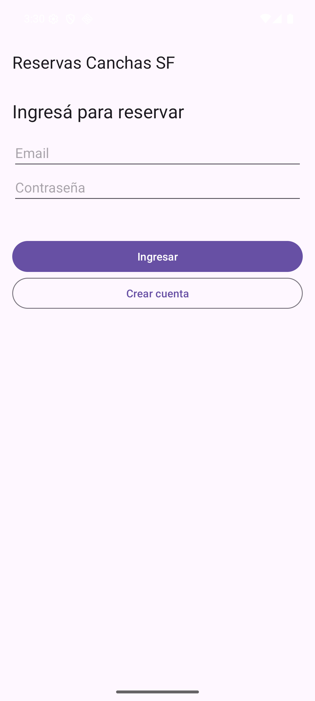
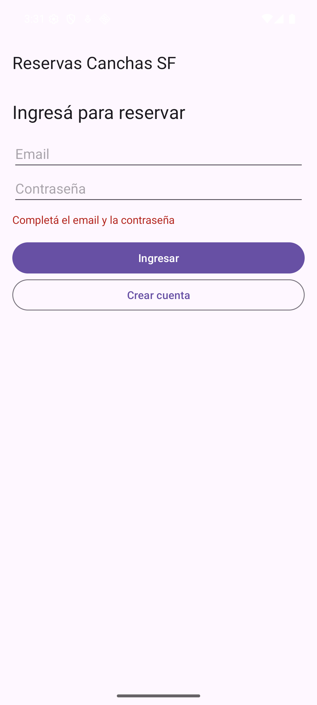
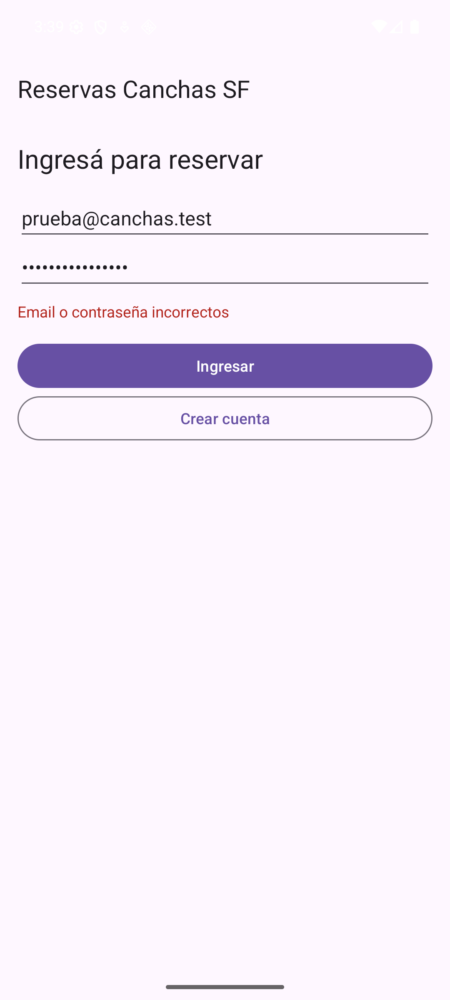
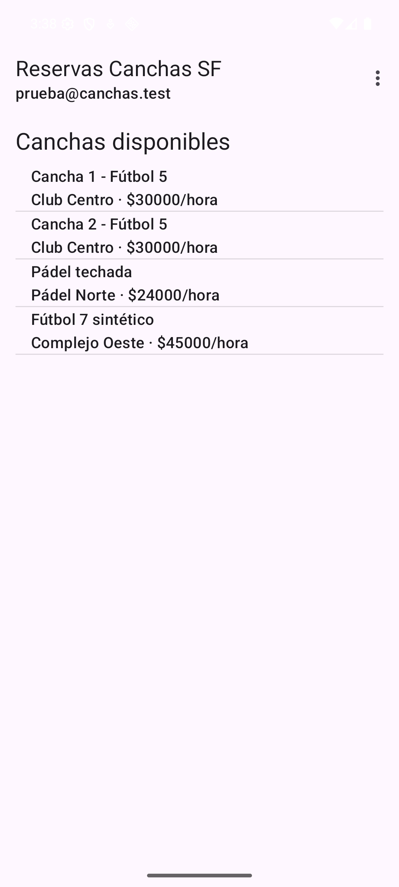
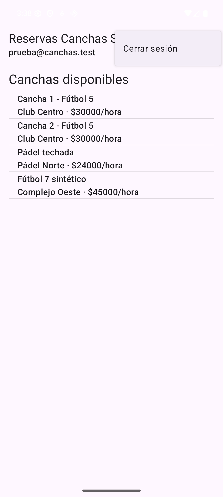
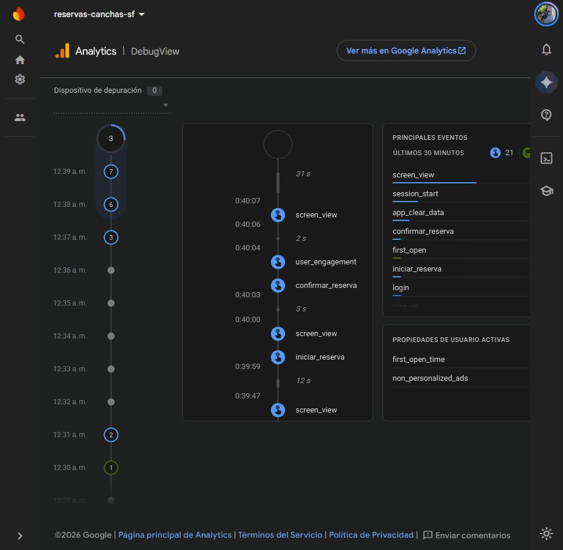
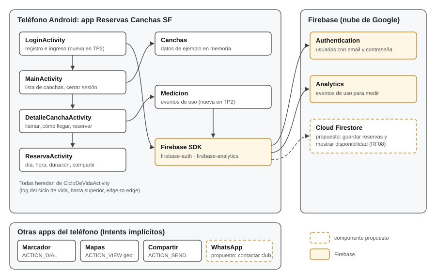

# Trabajo Práctico 2 — Aplicación del Ciclo de Build-Measure-Learn

**Cátedra:** Arquitecturas Móviles · Ing. Juan Pablo Bono
**Carrera:** Ingeniería en Sistemas de Información — UTN FR San Francisco
**Alumno:** Fernando Mare
**Fecha:** 01/10/2026
**Repositorio:** https://github.com/mareFernando03/reservas-canchas-sf

---

## 1. Objetivo

Según la guía del TP2: aplicar el ciclo Build-Measure-Learn en el desarrollo de una aplicación
móvil. Se parte de la app del TP1 (Reservas Canchas SF), se define su Producto Mínimo Viable,
se construye con Firebase Authentication, se prueba con usuarios reales y con lo aprendido se
actualiza el diagrama de arquitectura.

## 2. Definición del MVP

El capítulo 6 de *Lean Mobile App Development* ("MVP is Always More Minimal Than You Think")
toma la definición de Eric Ries: el MVP es la versión de un producto nuevo que permite obtener
la mayor cantidad de aprendizaje validado sobre los clientes con el menor esfuerzo. El libro
propone definirlo juntando sólo los componentes que, combinados, hacen al producto viable (el
ejemplo de la patineta: tabla, ruedas y ejes) y no cubrir todos los casos de uso desde el
principio.

**Problema.** En San Francisco los turnos de fútbol 5, fútbol 7 y pádel se reservan por teléfono o
WhatsApp, club por club. Para saber qué hay libre y cuánto cuesta hay que preguntar en cada uno.

**Hipótesis a validar.** Un jugador prefiere ver las canchas de la ciudad en un solo lugar y armar
la reserva desde el celular antes que llamar club por club.

**Qué entra en el MVP.** Siguiendo la idea de la patineta, los componentes que juntos permiten
recorrer el camino completo de una reserva. Ninguno sirve solo: una lista sin reserva no resuelve
nada, y una reserva sin cuenta no queda a nombre de nadie.

| Funcionalidad | Por qué entra |
|---|---|
| Registro e inicio de sesión (RF07) | Una reserva tiene que quedar a nombre de alguien. |
| Lista de canchas con club, deporte y precio (RF01) | Es la propuesta de valor: todo en un solo lugar. |
| Detalle, llamar al club y cómo llegar (RF02–RF04) | Resuelve las dudas antes de reservar. |
| Elegir día, hora y duración y ver el total (RF05) | Es la acción que se quiere medir. |
| Confirmar y compartir con el grupo (RF06) | Un partido se arma entre varios. |

**Qué queda afuera.** Pago en línea (TP4), recordatorios push (TP6), que cada club cargue sus
canchas y la disponibilidad real de horarios (RF08). No hacen falta para saber si la hipótesis se
sostiene.

**Qué se mide.** El libro plantea la fase *Learn* con dos preguntas: si el MVP resuelve un
problema de sus usuarios y si es viable, es decir, si ofrece algo por lo que estarían dispuestos a
pagar. Para responderlas se mide si los usuarios completan una reserva sin ayuda, dónde se traban,
si la usarían en lugar de llamar y si pagarían la seña desde la app (ver sección 4).

## 3. Construcción del MVP

### 3.1. Cambios respecto del TP1

| Componente | Cambio |
|---|---|
| `LoginActivity` | Nueva. Pantalla de inicio con registro e ingreso por email y contraseña. Si ya hay una sesión abierta pasa directo a la lista. |
| `MainActivity` | Muestra el email del usuario en la barra y agrega "Cerrar sesión" en el menú. Deja de ser la pantalla del launcher. |
| `Medicion` | Nueva. Envía a Firebase Analytics los eventos de uso de la sección 4. |
| `DetalleCanchaActivity`, `ReservaActivity` | Registran los eventos de uso. |
| `AndroidManifest.xml` | `LoginActivity` pasa a ser la Activity `LAUNCHER`; se declara el permiso `INTERNET`. |
| Gradle | Plugin `com.google.gms.google-services` 4.5.0 y Firebase BoM 34.19.0 con `firebase-auth` y `firebase-analytics`. |

### 3.2. Configuración de Firebase

1. Se creó el proyecto en la consola de Firebase y se registró la app Android con el paquete
   `ar.edu.utn.frsf.canchas`.
2. Se descargó `google-services.json` en `app/`. El plugin de Google Services lo lee al compilar.
3. En Authentication se habilitó el proveedor **Correo electrónico/contraseña**.

### 3.3. Autenticación

`LoginActivity` usa `FirebaseAuth`: `createUserWithEmailAndPassword` para crear la cuenta y
`signInWithEmailAndPassword` para ingresar. Las dos llamadas son asíncronas y responden en un
*listener*. Mientras esperan, los botones quedan deshabilitados para no mandar dos pedidos. Los
errores de Firebase se traducen a mensajes en español: contraseña de menos de 6 caracteres, email
ya registrado, credenciales incorrectas y falta de conexión.

Firebase conserva la sesión entre aperturas de la app, así que el login se ve una sola vez. Las
contraseñas no pasan por la app ni se guardan en el teléfono: las administra Firebase (RNF06).

### 3.4. Cómo se probó

El login se probó contra el **emulador local de Firebase Authentication** (Firebase Local
Emulator Suite), para no dejar cuentas de prueba en el proyecto real. Compilando con
`./gradlew assembleDebug -PauthEmulator=true`, `LoginActivity` llama a `useEmulator` y le habla
al emulador en la máquina de desarrollo. Sin esa opción usa el proyecto real de Firebase. El
permiso para usar http contra el emulador está sólo en la variante *debug*
(`app/src/debug/`), así que la versión de entrega no lo lleva.

Se verificó: crear la cuenta, que la sesión siga abierta al cerrar y volver a abrir la app,
cerrar sesión, el error con contraseña incorrecta y el error con campos vacíos.

<figure><figcaption>8. Pantalla de inicio</figcaption></figure>
<figure><figcaption>9. Campos vacíos</figcaption></figure>
<figure><figcaption>10. Contraseña incorrecta</figcaption></figure>
<figure><figcaption>11. Lista con el usuario en la barra</figcaption></figure>
<figure><figcaption>12. Menú Cerrar sesión</figcaption></figure>

## 4. Medición y aprendizaje

### 4.1. Cómo se midió

De los diez métodos de prueba de UX que lista el capítulo 6 se usaron tres: *task analysis*
(observar a la persona mientras hace tareas concretas), *moderated in-person testing* (prueba
presencial, la que el libro recomienda para móviles) y una encuesta corta al final.

- **Pruebas con usuarios:** [N] personas usaron la app en [dispositivo] siguiendo el guion de
  `docs/TP2-guion-pruebas.md`: cinco tareas sin ayuda y cuatro preguntas al final.
- **Eventos de uso en Firebase Analytics:**

| Evento | Cuándo se registra |
|---|---|
| `sign_up` / `login` | Al crear la cuenta o ingresar. |
| `ver_cancha` | Al abrir el detalle de una cancha. |
| `llamar_club`, `ver_mapa` | Al tocar "Llamar al club" o "Cómo llegar". |
| `iniciar_reserva` | Al tocar "Reservar turno". |
| `confirmar_reserva` | Al confirmar el turno (con la cantidad de horas). |

La relación entre `iniciar_reserva` y `confirmar_reserva` indica cuántos de los que empiezan una
reserva la terminan. Durante las pruebas el teléfono queda en modo depuración, así que los eventos
se ven en el momento en *DebugView*:

<figure class="ancha"><figcaption>13. DebugView de Firebase Analytics recibiendo los eventos de una reserva de prueba</figcaption></figure>

### 4.2. Resultados

<!-- TODO completar con los datos reales de las pruebas -->

### 4.3. Análisis y aprendizaje

<!-- TODO, con los pasos del libro: Analyze (qué surgió), Organize (patrones que se repiten),
     Compile (acciones concretas). Cerrar con la decisión de la fase Learn: perseverar o pivotar,
     respondiendo si resuelve el problema y si es viable. -->

## 5. Diagrama de arquitectura actualizado

<figure class="ancha"><figcaption>Arquitectura después del TP2. En línea punteada, el componente propuesto.</figcaption></figure>

Respecto del TP1 se agregan la pantalla de login, la medición de uso y los servicios de Firebase
Authentication y Analytics. Como componente adicional se propone **Cloud Firestore**, para
guardar las reservas y mostrar la disponibilidad real de cada horario (RF08).
<!-- TODO: ajustar los componentes propuestos según lo que salga de las pruebas -->

## 6. Repositorio

Código fuente, capturas y diagrama:
**https://github.com/mareFernando03/reservas-canchas-sf**
